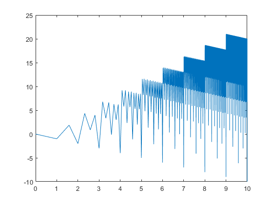
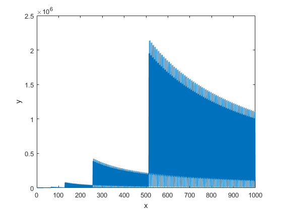

# matlab-experiment
This is just a small project exploring the ratio between a binary number and its reverse:
```
0 <= x <= 0b10000000000
y = reverse(x) / x
```

The program returns this plot (fig1):



Or if you remove the log-scaling (fig2):


